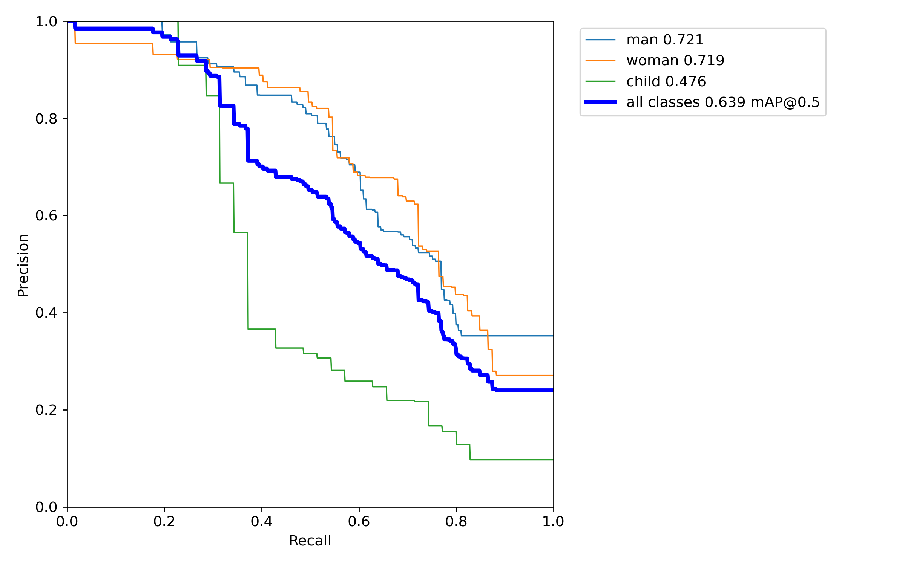

# Social_Distancing_Detector
## A Social Distancing Detector using Computer Vision
## Motivations & Industrial Utilizations

As COVID-19 begins to spike again all over the country, it is more important than ever to continue to social distance from people outside of your household. A tool that can be used by law enforcement agencies, security agencies, public health care agencies, private companies, academia, etc. would be a social distancing detector. Utilizing YOLOv5, I created a Fully Convolutional neural network (FCNN) that does just that in real time. 

## Background Information
### What is Social Distancing and how do you practice it?

Social distancing, also called “physical distancing”, means keeping a safe space between yourself and other people who are not from your household. To practice social or physical distancing, stay at least 6 feet (about 2 arms’ length) from other people who are not from your household in both indoor and outdoor spaces.

### What's its history?

Social distancing is by no means a new concept. Humans have been utilizing the idea behind social distancing for centuries. It even goes back to as early as the 14th century, where they used to create leper colonies and lazarettos as a means of preventing the spread of leprosy.

### Why is it so important?

Social distancing is one of a number of tools, and the best non-pharmaceutical tool, that can slow the spread of a respiratory virus. 

### What is a respiratory virus and what are the dangers if people don't follow social distancing?

Respiratory syncytial virus, or RSV, is a common respiratory virus that usually causes mild, cold-like symptoms. Most people recover in a week or two, but RSV can be serious, especially for infants, older adults, and people who are immunocompromised.  

## Datasets

### Image Datasets
* Training Data
  * Consists of 300 images
  * Web Scapped off Google Image Manually
  * Annotated Categories Using Makesense.ai
  * Contaings three categories:
    * man
    * woman
    * child
    
* Validation Data
  * Consists of 50 images
  * Web Scapped off Google Image Manually
  * Annotated Categories Using Makesense.ai
  * Contaings three categories:
    * man
    * woman
    * child
    
* Testing Data
  * Consists of 20 images
  * Web Scapped off Google Image Manually
  
  
### Video Dataset
* 43 minutes of video footage
* Video footage from security camera in parking lot

## Training the Model

Utilizing the YOLOv5 framework, I trained my model with the training and validation dataset, running the model with 3000 epochs over the 4 different frameworks (YOLOv5s, YOLOv5m, YOLOv5l, and YOLOv5x). I determined that YOLOv5x gave me the best accuracy with a Mean Average Precision (mAP_0.5) of 0.64 and a Recall of 0.60. The visualizations below show the trend and outcomes of my training and validation sets.

The following is the same information as shown above with a log functions applied to show beginning trends.

And Finally my validation set.

## The Math Behind Calculating Distance in an Image

*Note: This only applies to a 2-Dimensional Plane; further calculation and information is needed for a 3-Dimensional plane.*

So essentially, the idea is that you want to calculate the distance between the 4 corners of the bounding boxes and then take that average to get the distance from the center of the box, however in images, this takes a few steps.

### Step 1: Calculating the Pixels Per Metric (PPM)
To Calculation the pixels per metric first you must choose a metric. In this case, I chose inches. You must then use the following formula:

Simply put, you take the known height of an object, in my case I used a traffic guard post and divide it by the amount of pixels it is in the image.

### Step 2: Calculating the distance between 2 points

Just like in College Algebra, you use the distance formula but in this case you multiply it by the PPM we got above.

### Step 3: Calculating the Average

There is nothing fancy about this, you just take the sum of all 4 distances and divide by 4.

## Applying Social Distancing Detector

After running through all bounding boxes in the image and calculating the distance of each bounding box from every other.

## Implementation onto Video Stream

After having the model run through single images, I then implemented it onto a video stream.

## Next Steps

As you can see, my model mis-classified certain objects. Future steps I plan to take to improve this model are:

* Collect more training and validation data to make the model more precise.
* Get information of video camera from virat to deal with depth issue on a 3D plane.
* Implement more categories to prevent the mismatching of objects.
* Add a object detector for face mask to see if people are following mask laws.

## Resources

* Image Datasets: google.com/images
* Video Datasets: viratdata.org
* YOLOv5: github.com/ultralytics

### Credit to Yolo
Yolov5 is the newest version of YOLO, which is a real-time object detection framework and stands for You Only Look Once. Meaning the image is only passed once through the FCNN or Fully Convolutional neural network.

## Contact Info
Any questions or comments, please feel free to get in touch with me via one of the following options
* Email: tomjjoy123@gmail.com
* LinkedIn: linkedin.com/in/thomas-joy-ii
